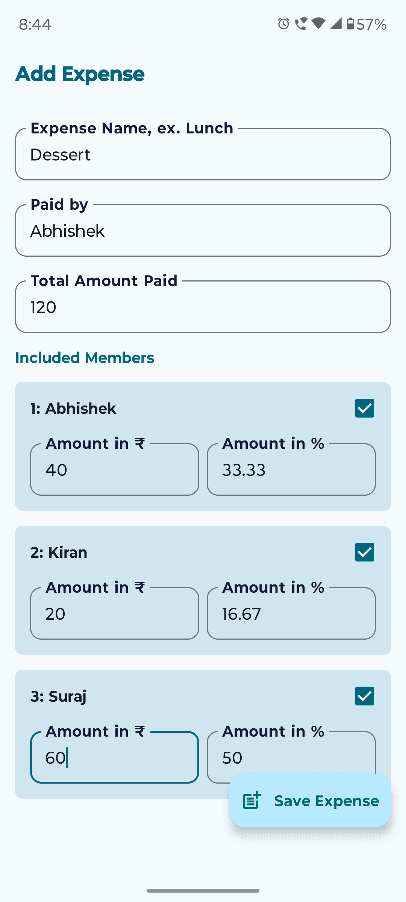
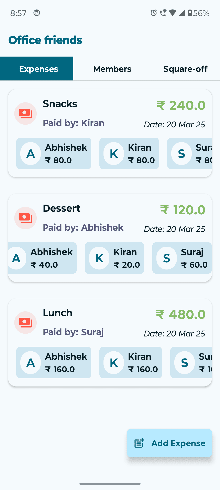
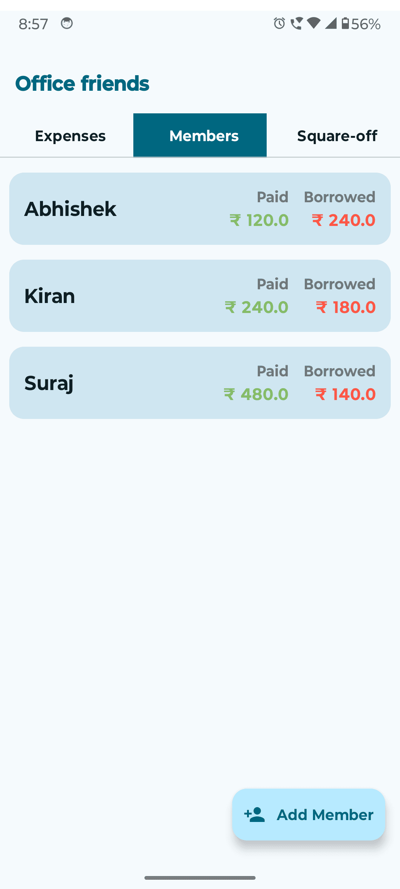
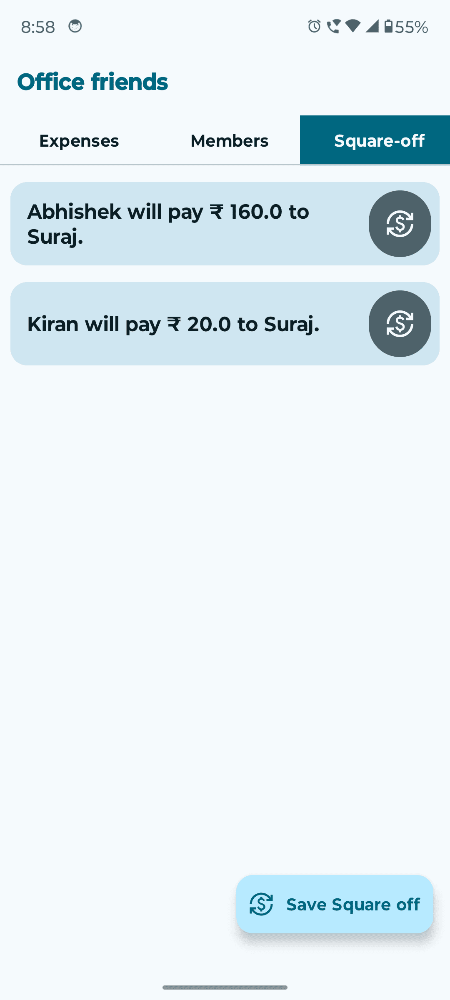
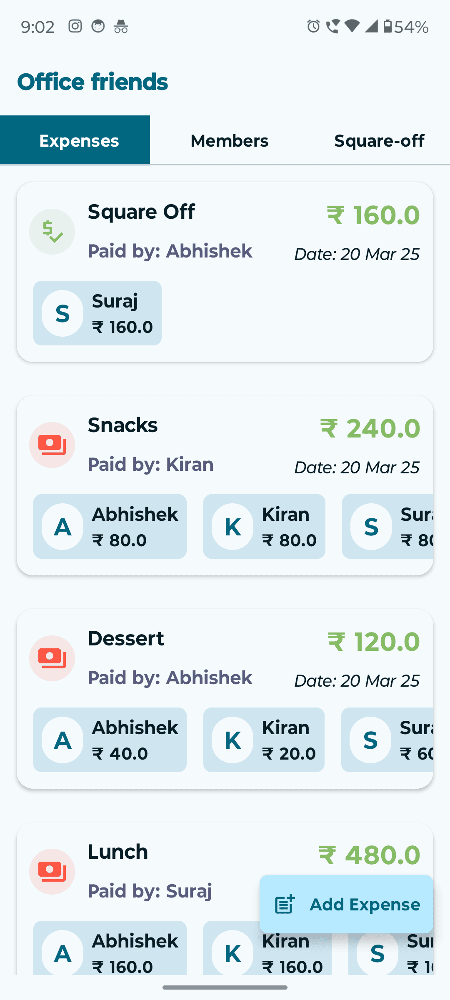
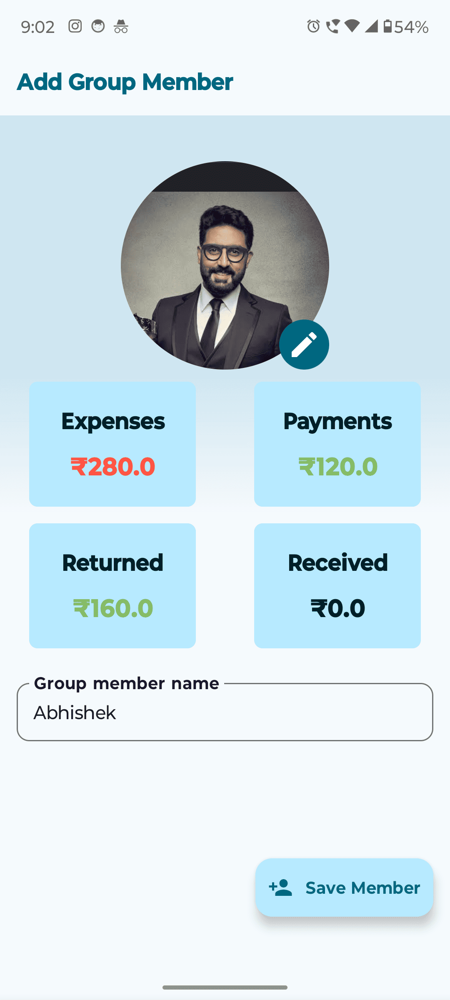

# GroupPay - Group Expense Manager App

**GroupPay** is a sleek Android app designed to help you and your friends track, split, and settle group expenses. Whether you're traveling, dining, or sharing other costs, GroupPay automatically calculates the minimum number of transactions required to square off all debts.

---

## Features

- **Track Expenses**: Add expenses with descriptions, amounts, and participants.
- **Flexible Splitting**: Split expenses equally or by custom portions (amount or percentage).
- **Optimized Settlements**: Automatically calculates the minimum number of transactions to settle all debts.
- **Modern UI**: Built using Material 3 for an intuitive and dynamic design.

---

## Tools & Technologies

This project leverages the following modern technologies:

### 🛠️ **Tech Stack**
<div align="center">
  
  
  
  
</div>


- **Jetpack Compose**: Declarative UI toolkit for building native Android UIs.
- **RealmDB**: A local database that’s fast and easy to use.
- **Koin**: Lightweight Dependency Injection (DI) framework.
- **Material 3**: The latest design system by Google for a beautiful UI experience.

---

### Screenshots:

<div align="center">
  
  
  
</div>
<div align="center">
  
  
  
</div>

### Screenshots Description:

- **Screenshot 1** (Add Expense Screen): This screen allows you to add the details of your expense, such as the expense name, the person who paid, the total amount spent, and the members to whom it will be split. You can choose to split the amount equally or in custom portions, either as fixed amounts or percentages.

- **Screenshot 2** (All Expenses Screen): This screen displays all the expenses made within a particular group, helping you track the overall expenses for better financial management.

- **Screenshot 3** (Group Members Screen): Here, you'll see a list of all the members of a specific group. It provides a quick overview of the people involved in the shared expenses.

- **Screenshot 4** (Balance Square-Off Screen): This screen calculates the minimum transactions required to settle all outstanding debts within the group. It shows who owes what and helps you square off the balances efficiently.

- **Screenshot 5** (All Expenses Screen with Square-Off Transactions): This screen displays both normal and squared-off transactions, marked with different icons for easy identification.

- **Screenshot 6** (Group Member Detail Screen): In this screen, you can add or update a group member's information. It also shows the total expenses paid by the member, the amount squared off, and the money received from other group members.

---

## Installation

Follow these steps to get the project up and running:

### Prerequisites
- **Android Studio** (latest version)
- **JDK 11+**

### Steps

1. **Clone the repository:**

    ```bash
    https://github.com/jabhi226/GroupPay.git
    ```

2. **Open the project** in Android Studio.

3. **Sync Gradle** to fetch the dependencies.

4. **Run the app** on an emulator or physical device.

---
